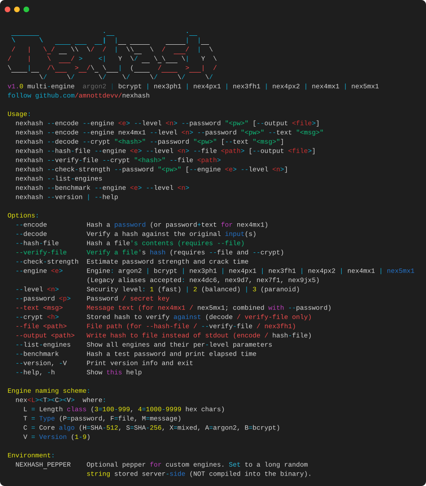
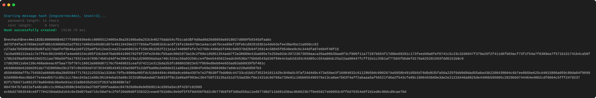
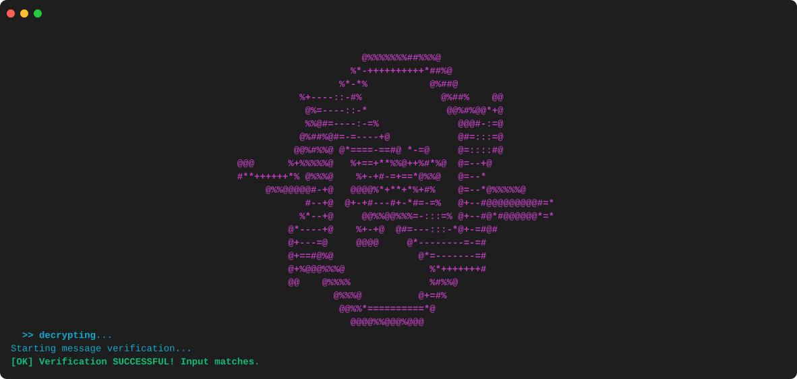

# CLI overview

This page walks through the NexHash command-line interface with screenshots and example invocations. Each section shows the exact command, the expected output, and a rendered preview of how it looks in a terminal.

The screenshots below were captured on a dark terminal theme. Output is colored via ANSI escape codes; colors will appear different (or be stripped entirely) depending on the terminal, but the textual content is identical.

---

## Startup banner

Running `nexhash` with no arguments (or with `--help`) prints the startup banner followed by the help text.

```bash
nexhash
# or
nexhash --help
```

The banner is the large ASCII-art "NEXHASH" wordmark followed by the engine list and the GitHub link.



---

## Encoding a password

Hash a password with any engine. The example below uses `nex4mx1` (the keyed-message engine) at level 3.

```bash
nexhash --encode --engine nex4mx1 --level 3 --password "my-secret" --text ""
```

Output is structured into three sections:

1. **Status line** — engine + level + per-input lengths.
2. **Result line** — success marker with elapsed time.
3. **Hash string** — the PHC-style crypt, here 2139 characters long.

Because the output is over 1000 characters, the CLI also prints a yellow `[warning] :` line advising the user to save it to a file (`--output`).



For shorter outputs, the warning is suppressed:

```bash
nexhash --encode --engine argon2 --level 2 --password "hunter2"
# Starting hash [engine=argon2, level=2]...
# Hash successfully created!  (18.42 ms)
# $argon2id$v=19$m=65536,t=3,p=1$<salt>$<hash>
```

To save the hash directly to a file instead of stdout:

```bash
nexhash --encode --engine nex4px2 --level 3 --password "secret" --output hash.txt
# Hash saved to: hash.txt
```

---

## Decoding (verifying a password)

Verification starts with a cinematic decode banner — the magenta ASCII-art piece followed by an animated `>> decrypting...` indicator — then runs the actual verification.

```bash
nexhash --decode --crypt "$argon2id$v=19$m=65536,t=3,p=1$..." --password "hunter2"
```



After the banner animation, the CLI prints the verification result:

```
Starting verification...
[OK] Verification SUCCESSFUL! Input matches.
```

On failure:

```
Starting verification...
[FAIL] Verification FAILED! Input does not match.
```

The decode mode auto-detects the engine from the PHC prefix, so you never need to pass `--engine` to `--decode`. For message-engine hashes (`nex4mx1`, `nex5mx1`), the CLI also requires `--text`:

```bash
nexhash --decode --crypt "$nexhash$nex4mx1$..." --password "my-secret" --text ""
```

---

## File hashing

Hash the contents of a file. The file is streamed in 64 KiB chunks, so memory usage is bounded regardless of file size.

```bash
nexhash --hash-file --file release.tar.gz --level 2
# Pentest warning: file encryption features can be misused.
# Hashing file [engine=nex3fh1, level=2]...
#   file: release.tar.gz
# File hash successfully created!  (42.18 ms)
# $nexhash$nex3fh1$2$200000$<file_size>$<salt>$<hash>
```

Verify a file against a stored hash:

```bash
nexhash --verify-file --crypt "$nexhash$nex3fh1$..." --file release.tar.gz
```

Any byte-level tampering with the file produces a different hash, so verification will fail with `[FAIL]`.

---

## Keyed-message hashing

The `nex4mx1` and `nex5mx1` engines combine a password (acting as a secret key) with arbitrary text. The two inputs are interleaved at the byte level with per-byte type tags, preventing the collision attacks that naive concatenation suffers from.

```bash
# Encode
nexhash --encode --engine nex5mx1 --level 2 \
  --password "server-secret" \
  --text "GET /api/users 2026-08-30T10:00:00Z"

# Verify
nexhash --decode --crypt "$nexhash$nex5mx1$..." \
  --password "server-secret" \
  --text "GET /api/users 2026-08-30T10:00:00Z"
```

Either input may be empty, but not both. The decode mode auto-detects message-engine hashes by their PHC prefix.

For memory-hard keyed-message hashing (recommended for production), use `nex5mx1`. For CPU-only with lower latency, use `nex4mx1` at level 1.

---

## Password strength

Estimate password strength and per-engine crack time on a reference GPU (single RTX 4090).

```bash
nexhash --check-strength --password "correct horse battery staple"
```

Output includes:

- Password length
- Estimated entropy in bits
- A verdict (Very Weak / Weak / Fair / Good / Strong), colored
- Actionable suggestions
- A comparison table of estimated crack time across all engines at level 2

Pass `--engine` and `--level` to estimate against a specific configuration:

```bash
nexhash --check-strength --password "MyP@ssw0rd" --engine nex5mx1 --level 3
```

If the password is weak, a yellow `[warning] :` line is printed suggesting a stronger password.

---

## Listing engines

```bash
nexhash --list-engines
```

Prints a per-engine, per-level parameter table. Each engine section shows its output size, the iteration count or Argon2 parameters per level, and the rough wall-clock time at that level.

---

## Benchmarking

```bash
nexhash --benchmark --engine nex5mx1 --level 3
```

Hashes a fixed test input and prints the elapsed time. Useful for picking the right level for your hardware.

File engines (`nex3fh1`) and message engines (`nex4mx1`, `nex5mx1`) cannot be benchmarked with this command because they require additional inputs (`--file`, `--password` + `--text`). Use `--encode` directly for those.

---

## Error reporting

When a flag is misspelled, missing a value, or given an invalid value, the CLI prints a precise error and an optional tip, then exits with code 1. It never silently drops to the help menu.

```
$ nexhash --encode --engne argon2 --level 1 --password "x"
[error] : Unknown flag: --engne
[tip]   : Did you mean --engine?
```

```
$ nexhash --encode --engine argon2 --level abc --password "x"
[error] : Invalid value for --level: 'abc' (not a valid integer)
[tip]   : Level 1 = fast, 2 = balanced (default), 3 = paranoid.
```

```
$ nexhash --encode --engine argon2 --level 1 --password
[error] : Flag --password requires a value.
[tip]   : Usage: nexhash ... --password <value>
```

The "did you mean" suggestion uses Levenshtein edit distance over all known flags. If no close match exists, the tip points to `--help` instead.

---

## Common recipes

| Task                                         | Command                                                                                       |
|----------------------------------------------|-----------------------------------------------------------------------------------------------|
| Hash a password (recommended)                | `nexhash --encode --engine argon2 --level 2 --password "..."`                                |
| Hash a password (memory-hard, long key)      | `nexhash --encode --engine nex5mx1 --level 2 --password "..." --text ""`                     |
| Save hash to file                            | Add `--output hash.txt`                                                                      |
| Verify a password                            | `nexhash --decode --crypt "<hash>" --password "..."`                                         |
| Verify a keyed message                       | `nexhash --decode --crypt "<hash>" --password "..." --text "..."`                            |
| Hash a file                                  | `nexhash --hash-file --file release.tar.gz --level 2`                                        |
| Verify a file                                | `nexhash --verify-file --crypt "<hash>" --file release.tar.gz`                               |
| Check password strength                      | `nexhash --check-strength --password "..."`                                                  |
| List engines                                 | `nexhash --list-engines`                                                                     |
| Benchmark an engine                          | `nexhash --benchmark --engine argon2 --level 3`                                              |
| Set a server-side pepper                     | `export NEXHASH_PEPPER="$(openssl rand -hex 32)"` before any `--encode` / `--decode`          |

For the complete flag reference, see [Usage](usage.md). For per-engine parameters and design notes, see [Engines](engines.md).
